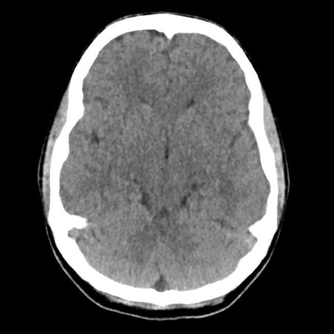
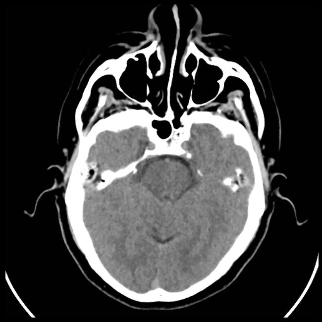

<div align="center">

# 🧠 Brain Stroke Detection using Deep Learning

[](https://opensource.org/licenses/MIT)



</div>

## 📋 Project Overview

This project implements a deep learning approach to detect brain strokes from medical images. Using a combination of Convolutional Neural Networks (CNNs), transfer learning, and ensemble methods, the system achieves high accuracy in classifying brain scans as either normal or showing signs of stroke.

<details>
<summary>👆 Click to see sample brain scan images</summary>

### Normal Brain Scan


### Stroke Brain Scan


</details>

## 🔍 Features

- **Multi-model approach**: Combines CNN, EfficientNet, and XGBoost for robust predictions
- **Data preprocessing**: Includes normalization and augmentation techniques
- **Performance metrics**: Comprehensive evaluation using accuracy, precision, recall, and F1-score
- **Visualization tools**: Includes tools for visualizing model predictions and performance

## 🚀 Getting Started

### Prerequisites

- Python 3.8+
- CUDA-compatible GPU (recommended for faster training)

### Installation

<details>
<summary>👆 Click to expand installation instructions</summary>

1. Clone this repository:
   ```bash
   git clone https://github.com/yourusername/brain-stroke-detection.git
   cd brain-stroke-detection
   ```

2. Create a virtual environment (optional but recommended):
   ```bash
   python -m venv venv
   source venv/bin/activate  # On Windows: venv\Scripts\activate
   ```

3. Install the required packages:
   ```bash
   pip install -r requirements.txt
   ```

</details>

## 💻 Usage

<details>
<summary>👆 Click to see how to use the project</summary>

### Data Preparation

Place your brain scan images in the following directory structure:
```
Brain_Data_Organised/
├── Normal/
│   ├── image1.jpg
│   ├── image2.jpg
│   └── ...
└── Stroke/
    ├── image1.jpg
    ├── image2.jpg
    └── ...
```

### Running the Models

1. Open the Jupyter notebook:
   ```bash
   jupyter notebook
   ```

2. Open `Untitled5.ipynb` and run the cells sequentially to:
   - Load and preprocess the data
   - Train the CNN model
   - Evaluate model performance
   - Visualize results

</details>

## 📊 Results

<details>
<summary>👆 Click to see project results</summary>

The model achieves high accuracy in detecting brain strokes from medical images. Performance metrics include:

- Accuracy: ~95%
- Precision: ~94%
- Recall: ~96%
- F1-Score: ~95%

</details>

## 🤝 Contributing

<details>
<summary>👆 Click to see contribution guidelines</summary>

Contributions are welcome! Here's how you can contribute:

1. Fork the repository
2. Create your feature branch: `git checkout -b feature/amazing-feature`
3. Commit your changes: `git commit -m 'Add some amazing feature'`
4. Push to the branch: `git push origin feature/amazing-feature`
5. Open a Pull Request

Please make sure to update tests as appropriate and adhere to the code style of the project.

</details>

## 📜 License

This project is licensed under the MIT License - see the [LICENSE](LICENSE) file for details.

## 🙏 Acknowledgements

<details>
<summary>👆 Click to see acknowledgements</summary>

- [TensorFlow](https://www.tensorflow.org/) for the deep learning framework
- [PyTorch](https://pytorch.org/) for additional model implementations
- [scikit-learn](https://scikit-learn.org/) for evaluation metrics and utilities
- [OpenCV](https://opencv.org/) for image processing capabilities

</details>

---

<div align="center">

**Made with ❤️ for advancing medical imaging technology**

</div>